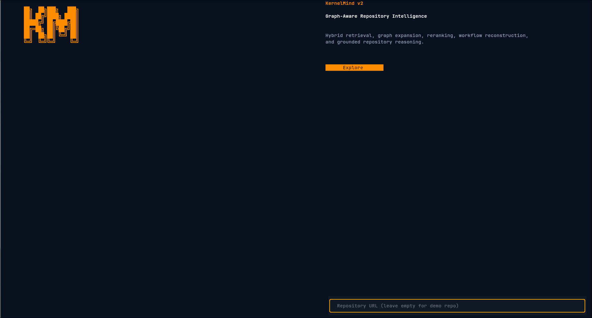
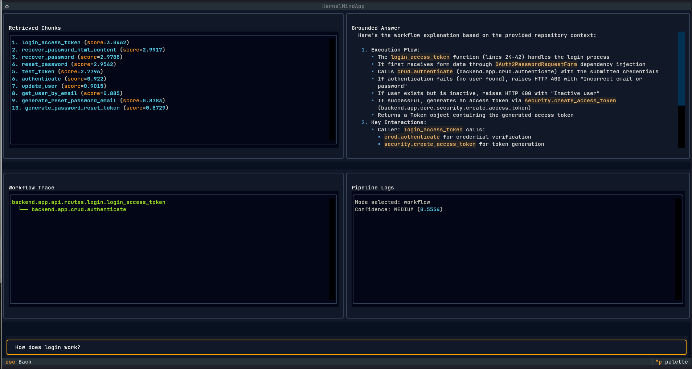

# KernelMind v2

> Graph-aware repository intelligence engine for grounded code retrieval, workflow reconstruction, and repository reasoning.

<p align="center">
  <i>Because semantic search alone is never enough.</i>
</p>

---

## What is KernelMind?

KernelMind is a retrieval + reasoning system built for understanding large repositories through:

* hybrid retrieval
* graph-aware expansion
* workflow reconstruction
* semantic reranking
* grounded answer generation
* repository-level reasoning traces

The system parses repositories into structured chunks, builds a call graph, retrieves semantically relevant regions, expands execution context using graph traversal, reranks candidates using a cross-encoder, and generates grounded responses from retrieved evidence.

KernelMind uses a hybrid architecture:
- grounded answer generation is currently handled through Sarvam AI
- retrieval, graph expansion, reranking, and evaluation run locally

Yes, my GPU has seen things.

---

# Architecture Overview

```text
Query
  │
  ▼
Query Classification
  │
  ▼
Hybrid Retrieval
(BM25 + Embeddings + RRF)
  │
  ▼
Query-Aware Seed Reranking
  │
  ▼
Graph Expansion
  │
  ├── Depth Decay
  ├── Propagation Scoring
  ├── Operation-Aware Traversal
  ├── Query Overlap Boosting
  └── Connectivity Weighting
  │
  ▼
Cross-Encoder Reranking
  │
  ▼
Reasoning Trace Construction
  │
  ▼
Context Building
  │
  ▼
Grounded Answer Generation
```

---

# Retrieval Pipeline

KernelMind uses a multi-stage retrieval pipeline designed specifically for repositories.

## Retrieval Stages

### 1. Embedding Retrieval

Semantic retrieval over chunk embeddings.

### 2. BM25 Retrieval

Exact lexical matching for:

* symbols
* identifiers
* filenames
* short tokens
* error strings

### 3. Reciprocal Rank Fusion (RRF)

Merges semantic and lexical retrieval.

### 4. Query-Aware Seed Ranking

Scores candidate seeds using:

* overlap
* chunk type
* propagation weighting
* retrieval confidence

### 5. Graph Expansion

Expands repository context using:

* forward traversal
* reverse traversal
* propagation scoring
* connectivity weighting
* operation-aware gating
* depth decay

### 6. Cross-Encoder Reranking

Final reranking pass using:

```text
cross-encoder/ms-marco-MiniLM-L-6-v2
```

### 7. Grounded Generation

LLM generation constrained to retrieved repository evidence. Here, I use Sarvam AI, 105b model, which, by the way, is given for FREE. I know, it surprised me too.

---

# Models

## Embeddings

```text
sentence-transformers/all-MiniLM-L6-v2
```

## Cross Encoder

```text
cross-encoder/ms-marco-MiniLM-L-6-v2
```

## Generation Provider

```text
Sarvam AI
```

KernelMind currently uses Sarvam AI for grounded answer generation.

## Local Evaluation Model

```text
Qwen 7B via Ollama
```

## Local Runtime Components

The retrieval stack, graph expansion, reranking pipeline, vector search, and evaluation infrastructure run locally.

Current local components include:

````text
FAISS
BM25
Cross-Encoder Reranking
Qwen 7B via Ollama
Sarvam AI
````

---

# Storage + Retrieval Infrastructure

## Vector Database

```text
FAISS
```

## Additional Retrieval Systems

* BM25
* graph propagation
* reranking layers
* workflow reconstruction
* reasoning traces

---

# Supported Languages

Currently supported:

* Python
* Eventually working to add other languages - feel free to help!

Additional languages can be added through parser extensions.

---

# Query Modes

KernelMind routes queries into different execution modes.

**Workflow Mode** - Deep graph traversal and execution reconstruction.

**Symbol Lookup** - Precision-oriented retrieval with minimal expansion.

**Architecture Mode** - Broader repository exploration.

**General QA** - Balanced retrieval fallback.

---

# TUI Interface

KernelMind includes a Textual-based terminal interface featuring:

* repository querying
* retrieval observability
* graph traces
* ranked chunk inspection
* streamed grounded answers
* workflow visualization

<p align="center">
  
</p>
<p align="center">
  
</p>

---

# RAGAS Evaluation

KernelMind includes evaluation support using:

```text
RAGAS
```

with local Ollama-hosted Qwen evaluation.

## Results

| Configuration           | Faithfulness | Answer Relevancy | Context Precision | Context Recall |
| ----------------------- | ------------ | ---------------- | ----------------- | -------------- |
| Graph Expansion Enabled | 0.6080       | 0.7697           | 0.5962            | 0.5357         |
| Graph Expansion Relaxed | 0.6356       | 0.8478           | 0.4732            | 0.5714         |

---

# Interpreting The Results

The evaluation surfaced an important retrieval tradeoff:

* stricter graph traversal improved precision
* relaxed traversal improved workflow continuity and answer relevancy
* broader graph expansion improved recall
* excessive traversal suppression reduced execution-chain visibility

This is currently one of the most interesting active areas of experimentation in the project.

The system is effectively balancing:

```text
precision ↔ recall
semantic locality ↔ workflow continuity
```

which is a surprisingly deep rabbit hole once graph propagation enters the picture.

---

# Current Features

* Hybrid retrieval
* FAISS vector search
* BM25 lexical retrieval
* Graph-aware expansion
* Propagation scoring
* Cross-encoder reranking
* Query-aware traversal
* Workflow reconstruction
* Reasoning traces
* Grounded generation
* Persistent repository runtimes
* Textual-based TUI
* Local-first execution - well, *mostly!*

---

# Example CLI Flow

```bash
python -m app.tui
```

```text
Query → Retrieval → Expansion → Reranking → Grounded Response
```

---

# Why KernelMind Exists

Most repository assistants:

* retrieve disconnected chunks
* ignore execution structure
* lose workflow continuity
* hallucinate relationships
* flatten repositories into embeddings

KernelMind attempts to preserve:

* execution topology
* call relationships
* workflow causality
* repository structure
* retrieval transparency

while still remaining practical to run locally.

___

# Contributions

Contributions are welcome.

Especially if you enjoy:

* retrieval systems
* graph reasoning
* semantic search
* code intelligence
* information retrieval
* systems engineering
* debugging graph propagation at 2 AM

Open issues, ideas, experiments, benchmarks, weird retrieval failures, and improvements are all appreciated.

---
